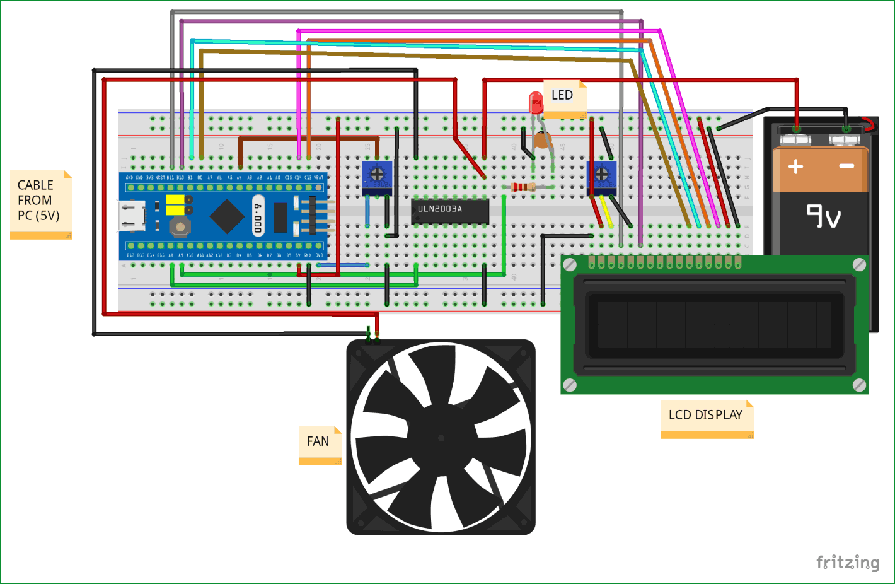
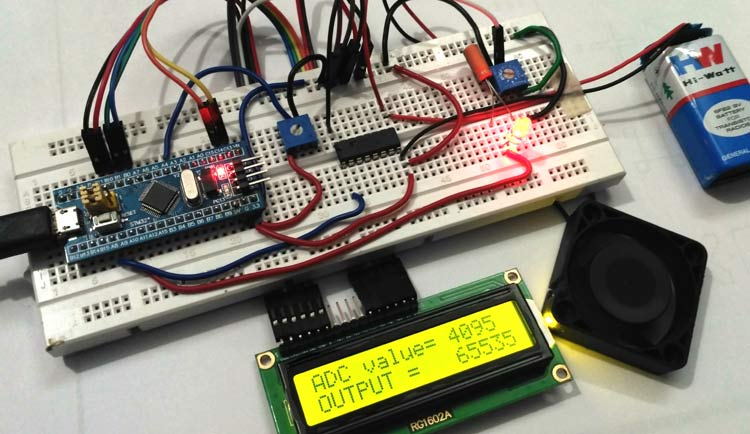

# STM32F103C8 PWM Fan Speed Control

This project demonstrates how to control the speed of a DC fan and the brightness of an LED using Pulse Width Modulation (PWM) on the **STM32F103C8** microcontroller. The PWM duty cycle is adjusted using a potentiometer, and a 16×2 LCD displays both the ADC reading and the mapped PWM output.

---

## 📌 Repository Contents

- **`/src`** → main project source code (`main.ino` or `main.cpp`)  
- **`/lib`** → additional libraries (e.g., `LiquidCrystal`)  
- **`/docs`** → circuit diagrams and wiring notes  
- **`/images`** → circuit diagram and hardware setup photos  

---

## 🔧 Features

- 16-bit PWM generation with STM32F103C8  
- Analog input via potentiometer (ADC)  
- Fan speed control using ULN2003 driver IC  
- LED brightness control directly via PWM  
- Real-time value display on a 16×2 LCD  

---

## 🛠️ Components Required

- STM32F103C8 development board  
- DC fan (9 V or 12 V)  
- ULN2003 motor driver  
- LED + current-limiting resistor  
- Potentiometer(s)  
- 16×2 LCD module  
- External power supply (e.g., 9 V battery)  
- Breadboard and jumper wires  

---

## ⚡ Circuit Diagram

The complete wiring of the project is shown below:  

  

---

## 🖼️ Hardware Setup

The real hardware implementation on a breadboard is shown here:  

  

---

## 📜 Source Code

The firmware is located in [`/src`](./src).  
It performs the following tasks:  

1. Reads the analog voltage from the potentiometer via ADC.  
2. Maps the ADC value (0–4095) to a 16-bit PWM range (0–65535).  
3. Updates PWM outputs to drive the LED and fan.  
4. Displays the ADC and PWM values on the LCD.  

Example snippet:  

```cpp
int valueADC = analogRead(PA4);
int result = map(valueADC, 0, 4095, 0, 65535);

pwmWrite(PA9, result);   // LED brightness
pwmWrite(PA8, result);   // Fan speed
